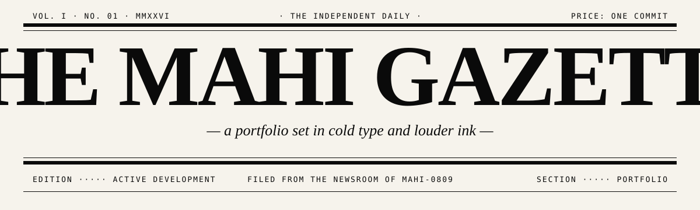
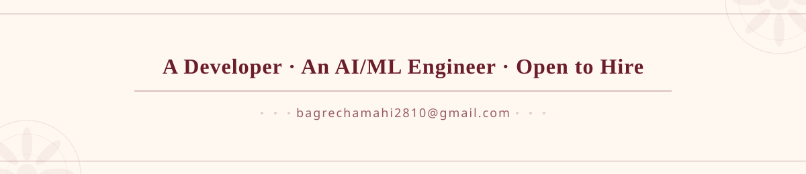
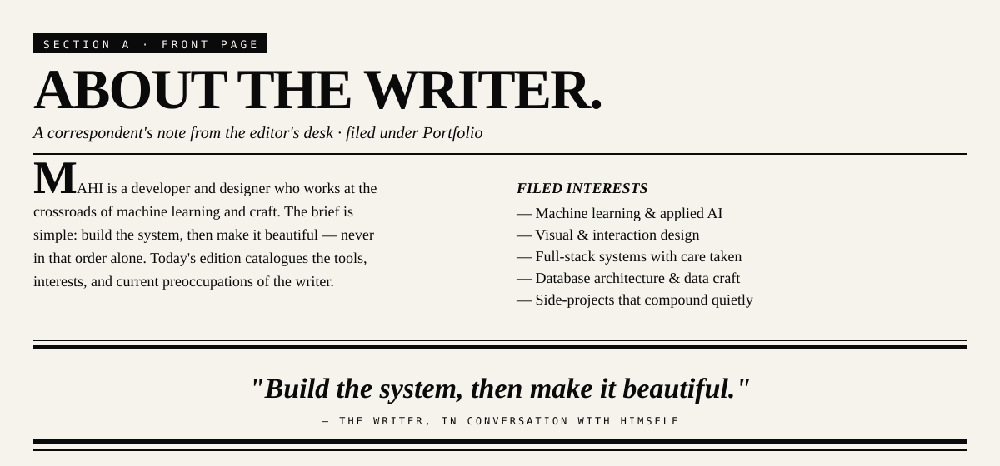
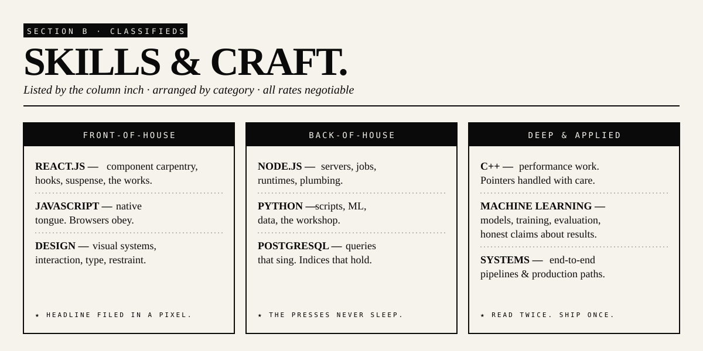
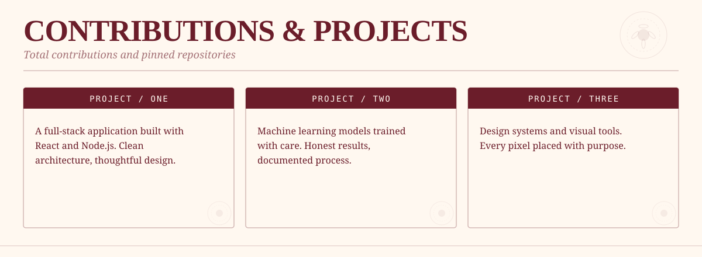
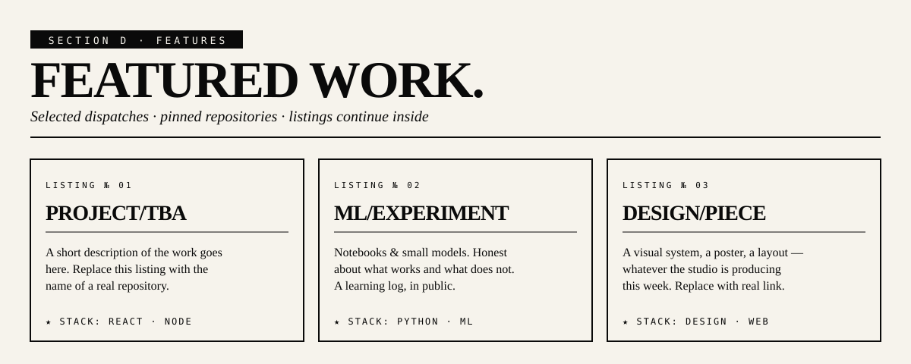
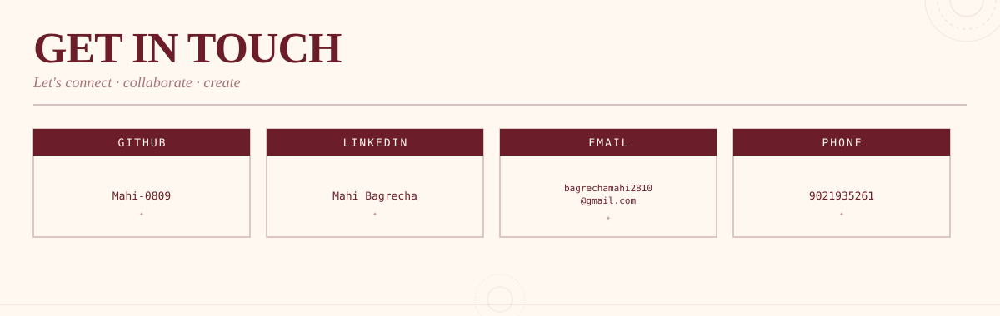
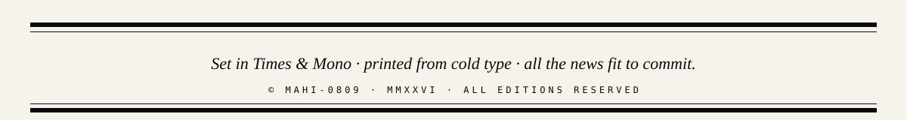

<!-- ============================================================ -->
<!--   THE MAHI GAZETTE · VOL. I · NO. 01                         -->
<!--   A brutalist-newspaper portfolio for Mahi-0809              -->
<!-- ============================================================ -->

  

  

  

  
  
  
  
  
  
  

 

  

  <a href="https://github.com/Mahi-0809?tab=repositories">→ Browse all repositories</a> &nbsp;·&nbsp;
  <a href="https://github.com/Mahi-0809">→ Profile</a>

 

<h2><i>★ &nbsp; STATISTICS DESK</i></h2>
FIGURES OBSERVED · TABULATED · FILED IN COLD TYPE

  

&nbsp;

  

  <a href="mailto:mahi@example.com">Email</a> &nbsp;·&nbsp;
  <a href="https://linkedin.com/in/placeholder">LinkedIn</a> &nbsp;·&nbsp;
  <a href="https://github.com/Mahi-0809">GitHub</a> &nbsp;·&nbsp;
  <a href="https://example.com">Portfolio</a>

 

<em>This edition goes to press daily. Last filed: see commit history.</em>

